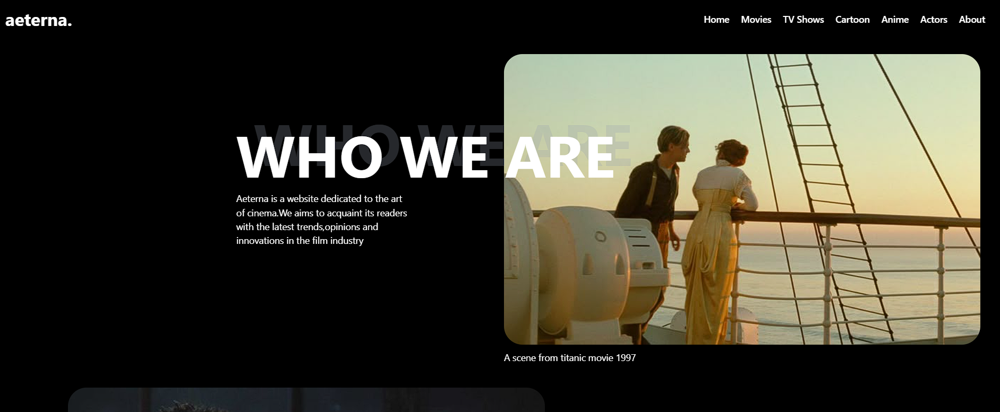

# 🎬 Aeterna UI Clone

A cinematic landing page UI built with **React** and **Tailwind CSS**. Inspired by movie/series platforms like Netflix and A24, this design features bold typography, image overlays, and dramatic text styling.

# 🧰 Tech Stack

- ⚛️ React (Vite)
- 🎨 Tailwind CSS
- 📁 Component-based architecture
- 💻 Responsive design

## 📸 Screenshots

| Dark Cinematic Layout |
|------------------------|
|  |

## 🧩 Features

- Hero section with overlapping text on image
- Tailwind-powered text shadows
- Responsive and mobile-friendly layout
- Smooth scroll to top (if implemented)

## 🛠️ Getting Started

To run this project locally:

```bash
git clone https://github.com/Niranjan531-droid/aeterna-ui-clone.git
cd aeterna-ui-clone
npm install
npm run dev